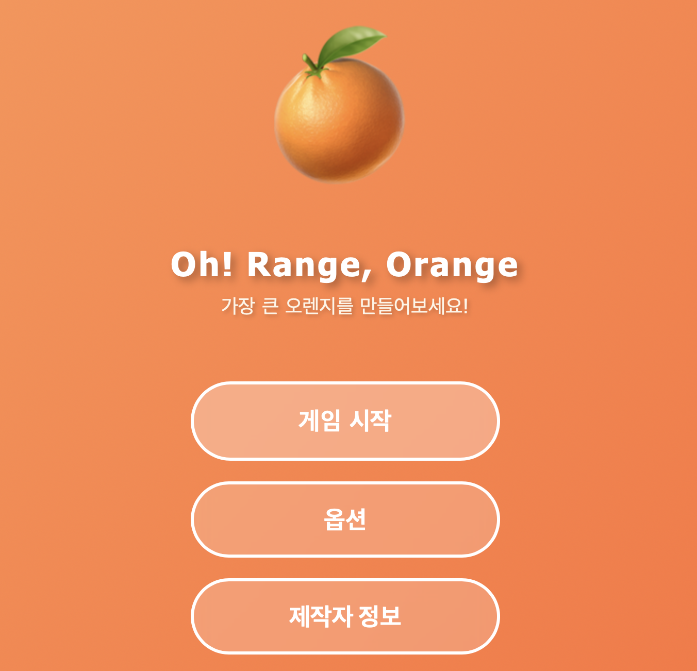

# Oh? Range, Orange!🍊
> Range로 Orange🍊를 키우자

오렌지를 키우는 타이밍 게임입니다. 게이지를 잘 멈춰서 오렌지를 최대한 크게 키워보세요!



## 📋 목차

- [주요 기능](#✨-주요-기능)
- [기술 스택](#🛠-기술-스택)
- [시작하기](#🚀-시작하기)
- [프로젝트 구조](#📁-프로젝트-구조)
- [게임 규칙](#🎮-게임-규칙)
- [내부 API](#📡-내부-API)
- [개발 과정](#💡-개발-과정)

## ✨ 주요 기능

- 🎯 **타이밍 게임**:
- 🌱 **성장 시스템**: 
- 📊 **점수 시스템**: 
- 🔊 **효과음**: 
- 🎨 **반응형 디자인**: 
- 🔒 **서버 검증**: 

## 🛠 기술 스택

### Backend
- **Node.js** - JavaScript 런타임
- **Express.js** - 웹 프레임워크
- **Express Session** - 세션 관리
- **EJS** - 템플릿 엔진

### Frontend
- **Vanilla JavaScript** - 프론트엔드 로직
- **CSS3** - 스타일링 및 애니메이션
- **Web Audio API** - 효과음 재생

## 🚀 시작하기

### 필수 요구사항

- Node.js 14.x 이상
- npm 또는 yarn

### 설치 및 실행

```bash
# 저장소 클론
git clone https://github.com/jynoh00/OhrangeOrange.git
cd OhrangeOrange

# 의존성 설치
npm install

# 개발 서버 실행
npm start

# 브라우저에서 접속
# http://localhost:3000
```

### 환경 변수 설정

`.env` 파일을 생성하고 다음 내용을 추가하세요:

```env
PORT=3000
SESSION_SECRET=your-secret-key-here
NODE_ENV=development
```

## 📁 프로젝트 구조

```
orange-growing-game/
├── bin/
│   ├── www                 # Express 서버(http) 시작
├── src/
│   ├── app.js                 # Express 앱 설정
│   ├── config/                # 설정 파일
│   ├── controllers/
│   │   └── gameController.js  # 게임 API 로직
│   ├── middleware/            # 커스텀 미들웨어
│   ├── models/
│   │   └── gameState.js       # 게임 상태 관리
│   ├── routes/
│   │   ├── index.js           # 메인 라우트
│   │   ├── game.js            # 게임 라우트
│   │   └── error.js           # 에러 라우트
│   ├── utils/                 # 유틸리티 함수
│   └── views/
│       ├── index.ejs          # 메인 페이지
│       ├── game.ejs           # 게임 페이지
│       └── error.ejs          # 에러 페이지
├── public/
│   ├── css/
│   │   └── game.css           # 게임 스타일
│   ├── js/
│   │   └── game.js            # 게임 클라이언트 로직
│   └── sounds/
│       └── click.mp3          # 효과음 파일
├── .env                       # 환경 변수
├── .gitignore
├── package.json
└── README.md
```

## 🎮 게임 규칙

1. **시작**: 게임이 시작되면 게이지가 0~100 사이를 왕복합니다
2. **첫 시도**: 스페이스바 또는 버튼을 눌러 게이지를 멈추면 씨앗(🌱)이 심어집니다
3. **성장**: 이전 시도보다 **높은 값**에 멈춰야 오렌지(🍊)가 자랍니다
4. **실패**: 이전 값보다 낮거나 같은 값에 멈추면 게임이 종료됩니다
5. **목표**: 오렌지를 최대한 크게 키우세요!

### 조작법
- `스페이스바` 또는 `버튼 클릭`: 게이지 정지

## 📡 내부 API

### POST `/game/start`
게임 세션을 시작합니다.

**Response:**
```json
{
  "success": true,
  "sessionId": "session-id",
  "state": {
    "previousValue": null,
    "orangeSize": 20,
    "attempts": 0,
    "isGameOver": false
  }
}
```

### POST `/game/stop`
게이지를 멈추고 결과를 받습니다.

**Request:**
```json
{
  "stoppedValue": 75.5
}
```

**Response:**
```json
{
  "success": true,
  "result": {
    "stoppedValue": 75.5,
    "success": true,
    "message": "오렌지를 키워주세요!",
    "icon": "🍊",
    "orangeSize": 120,
    "fillWidth": 75.5
  }
}
```

### POST `/game/restart`
다음 라운드를 시작합니다.
```json
{
  "success": true,
  "state": //game.getState()
}
```

### GET `/game/state`
현재 게임 상태를 조회합니다.

## 💡 개발 과정

### 개발 동기

..

### 아키텍처 결정

이 프로젝트는 **클라이언트-서버 분리 아키텍처**를 채택했습니다:

- **프론트엔드**: UI 렌더링과 애니메이션만 담당
- **백엔드**: 게임 로직과 검증을 처리하여 보안 강화

### 마주한 문제점들

1. **프론트-백엔드 동기화**
   - 문제: 
   - 해결: 

2. **세션 관리**
   - 문제:
   - 해결: 


## 👤 개발자

**jynoh00**

- GitHub: [@jynoh00](https://github.com/jynoh00)
- Email: wndus123sh@naver.com
